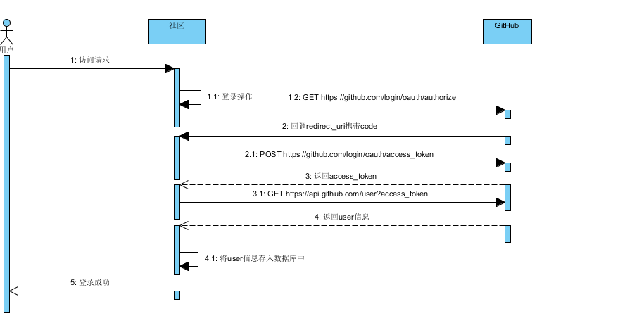

## 简单社区

### 参考资料
[spring boot文档](https://zed058.cn/code/dev/Spring%20Boot%20%E5%85%A5%E9%97%A8.html) （后端框架）

[bootstrap文档](https://v3.bootcss.com/getting-started/) （前端框架）

[Thymeleaf文档](https://spring.io/guides/gs/serving-web-content/)  （模板引擎）

[github OAuth](https://developer.github.com/apps/building-oauth-apps/creating-an-oauth-app/) （通过GitHub API登录社区）

### 所用工具
[Visual Paradigm](https://www.visual-paradigm.com/cn/download/) （用来画uml时序图）

[okHttp](https://square.github.io/okhttp/) （okHttp文档，发送post请求）

[FastJSON](https://mvnrepository.com/artifact/com.alibaba/fastjson) （用fastJson转换工具）

## github登录

